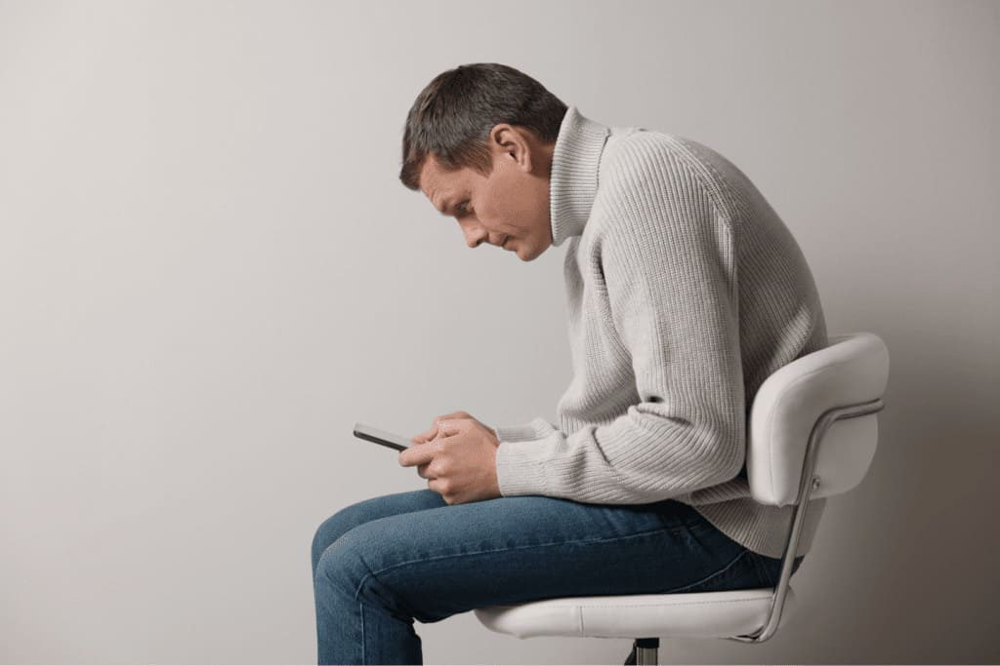
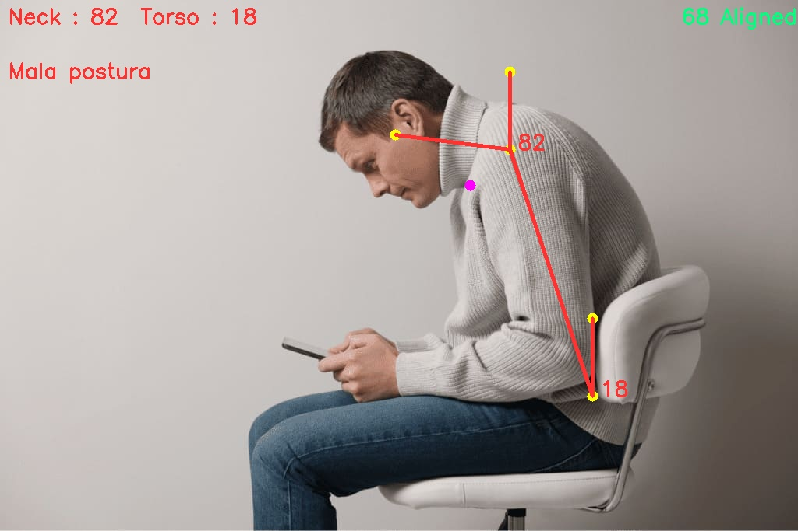
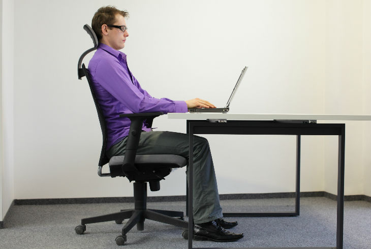
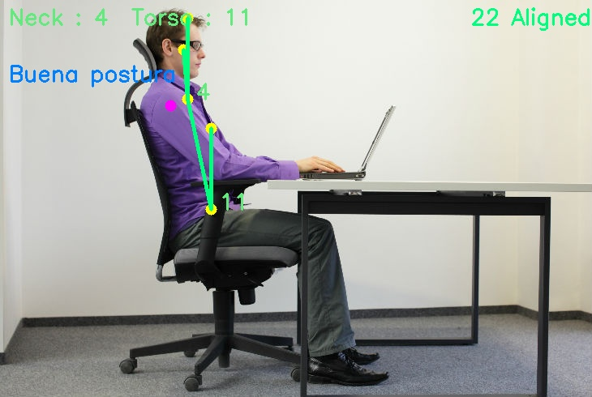

# ANÁLISIS DE POSE

### AUTORES:
+ López Álvarez Luis Ángel
+ Ramírez Salas Carlos
+ Rangel Mendez David Alberto
+ Sánchez Rodríguez Irmin Yael
+ Vargas Soriano Flor Arlette
+ Vázquez Lona Arturo


**DESCRIPCION:** Se presenta un sistema que análisa la postura de un inviduo sentado, para determinar si tiene o no una postura correcta.

## Librerias utilizadas


### MediaPipe
MediaPipe es la forma más sencilla para investigadores y desarrolladores de construir soluciones y aplicaciones de ML de clase mundial para móviles, borde, nube y la web.
```python
pip install mediapipe
```


### OpenCV
OpenCV es la biblioteca de visión por computadora más grande del mundo. Es de código abierto, contiene más de 2500 algoritmos y es operada por la fundación sin fines de lucro Open Source Vision Foundation.
```python
pip install opencv-python
```

## Desarrollo
A continuación, se presenta el desarrollo para detectar si hay buena o mala postura de una persona sentada mediante una imagen.

### Importamos las librerías
```python
import cv2
import time
import math as m
import mediapipe as mp
```

### Definimos funciones matemáticas
Las funciones matemáticas a definir se usan para calcular la distancia entre los dos hombros y el angulo de inclinación de la cabeza

#### Distancia entre los hombros

La función findDistance nos ayuda a determinar la distancia de desplazamiento entre dos puntos. Puede ser los puntos de la cadera, los ojos o los hombros. Como estos puntos siempre son más o menos simétricos con respecto al eje central. Con esto, vamos a incorporar la asistencia de alineación de la cámara en el script. La distancia se calcula utilizando la fórmula de distancia.

$$distancia = \sqrt{(x_2 - x_1)^2 + (y_2 - y_1)^2}$$

```python
def findDistance(x1, y1, x2, y2):
    dist = m.sqrt((x2-x1)**2+(y2-y1)**2)
    return dist
```

#### Angulo de inclinación del cuello

Este es el factor determinista principal para la postura. Se utiliza el ángulo formado por la línea del cuello y la línea del torso con el eje y. La línea del cuello conecta el hombro y el ojo, aquí se toma el hombro como punto pivote. De manera similar, la línea del torso conecta la cadera y el hombro, donde la cadera se considera el punto pivote.

$$\theta = \arccos\left(\frac{y_1^2 - y_1 y_2}{y_1 \sqrt{(x_2 - x_1)^2 + (y_2 - y_1)^2}}\right)$$

```python
def findAngle(x1, y1, x2, y2):
    theta = m.acos((y2 -y1)*(-y1) / (m.sqrt((x2 - x1)**2 + (y2 - y1)**2) * y1))
    degree = int(180/m.pi)*theta
    return degree
```

### Definimos algunas variables de estilo
```python
#Definimos la fuente de los mensajes
font = cv2.FONT_HERSHEY_SIMPLEX

#Definimos los colores a utilizar en el proyecto
blue = (255, 127, 0)
red = (50, 50, 255)
green = (127, 255, 0)
dark_blue = (127, 20, 0)
light_green = (127, 233, 100)
yellow = (0, 255, 255)
pink = (255, 0, 255)
```

### Inicializamos las clases de MediaPipe
```python
mp_pose = mp.solutions.pose
pose = mp_pose.Pose()
```

### Realizamos el procesamiento
```python
with mp_pose.Pose(static_image_mode = True) as pose:
    image = cv2.imread("malo1.jpeg")
    h, w = image.shape[:2]
    
    imagen_rgb = cv2.cvtColor(image, cv2.COLOR_BGR2RGB)
    results = pose.process(imagen_rgb)
    
    lm = results.pose_landmarks
    lmPose = mp_pose.PoseLandmark
    
    # Obtenemos las coordenadas de los puntos clave
    # Once aligned properly, left or right should not be a concern.      
    # Hombro izquierdo
    l_shldr_x = int(lm.landmark[lmPose.LEFT_SHOULDER].x * w)
    l_shldr_y = int(lm.landmark[lmPose.LEFT_SHOULDER].y * h)
    # Hombro derecho
    r_shldr_x = int(lm.landmark[lmPose.RIGHT_SHOULDER].x * w)
    r_shldr_y = int(lm.landmark[lmPose.RIGHT_SHOULDER].y * h)
    # Oreja izquierda
    l_ear_x = int(lm.landmark[lmPose.LEFT_EAR].x * w)
    l_ear_y = int(lm.landmark[lmPose.LEFT_EAR].y * h)
    # Cadera izquierda
    l_hip_x = int(lm.landmark[lmPose.LEFT_HIP].x * w)
    l_hip_y = int(lm.landmark[lmPose.LEFT_HIP].y * h)

    #Calculamos la distancia entre el hombro izquierdo y el hombro derecho
    offset = findDistance(l_shldr_x, l_shldr_y, r_shldr_x, r_shldr_y)

    if offset < 100:
        cv2.putText(image, str(int(offset)) + ' Aligned', (w - 150, 30), font, 0.9, green, 2)
    else:
        cv2.putText(image, str(int(offset)) + ' Not Aligned', (w - 150, 30), font, 0.9, red, 2)

    #Se calculan los angulos de inclinación
    neck_inclination = findAngle(l_shldr_x, l_shldr_y, l_ear_x, l_ear_y)
    torso_inclination = findAngle(l_hip_x, l_hip_y, l_shldr_x, l_shldr_y)

    #Dibujamos las lineas de referencia
    cv2.circle(image, (l_shldr_x, l_shldr_y), 7, yellow, -1)
    cv2.circle(image, (l_ear_x, l_ear_y), 7, yellow, -1)

    # Let's take y - coordinate of P3 100px above x1,  for display elegance.
    # Although we are taking y = 0 while calculating angle between P1,P2,P3.
    cv2.circle(image, (l_shldr_x, l_shldr_y - 100), 7, yellow, -1)
    cv2.circle(image, (r_shldr_x, r_shldr_y), 7, pink, -1)
    cv2.circle(image, (l_hip_x, l_hip_y), 7, yellow, -1)

    # Similarly, here we are taking y - coordinate 100px above x1. Note that
    # you can take any value for y, not necessarily 100 or 200 pixels.
    cv2.circle(image, (l_hip_x, l_hip_y - 100), 7, yellow, -1)

    # Put text, Posture and angle inclination.
    # Text string for display.
    angle_text_string = 'Neck : ' + str(int(neck_inclination)) + '  Torso : ' + str(int(torso_inclination))

    # Determine whether good posture or bad posture.
    # The threshold angles have been set based on intuition.
    if int(neck_inclination) < 40 and int(torso_inclination) < 20:
        
        print("Buena postura")
        
        cv2.putText(image, angle_text_string, (10, 30), font, 0.9, light_green, 2)
        cv2.putText(image, "Buena postura", (10, 100), font, 0.9, blue, 2)
        cv2.putText(image, str(int(neck_inclination)), (l_shldr_x + 10, l_shldr_y), font, 0.9, light_green, 2)
        cv2.putText(image, str(int(torso_inclination)), (l_hip_x + 10, l_hip_y), font, 0.9, light_green, 2)

        # Join landmarks.
        cv2.line(image, (l_shldr_x, l_shldr_y), (l_ear_x, l_ear_y), green, 4)
        cv2.line(image, (l_shldr_x, l_shldr_y), (l_shldr_x, l_shldr_y - 100), green, 4)
        cv2.line(image, (l_hip_x, l_hip_y), (l_shldr_x, l_shldr_y), green, 4)
        cv2.line(image, (l_hip_x, l_hip_y), (l_hip_x, l_hip_y - 100), green, 4)

    else:
        
        print("Mala postura")
        
        cv2.putText(image, angle_text_string, (10, 30), font, 0.9, red, 2)
        cv2.putText(image, "Mala postura", (10, 100), font, 0.9, red, 2)
        cv2.putText(image, str(int(neck_inclination)), (l_shldr_x + 10, l_shldr_y), font, 0.9, red, 2)
        cv2.putText(image, str(int(torso_inclination)), (l_hip_x + 10, l_hip_y), font, 0.9, red, 2)

        # Join landmarks.
        cv2.line(image, (l_shldr_x, l_shldr_y), (l_ear_x, l_ear_y), red, 4)
        cv2.line(image, (l_shldr_x, l_shldr_y), (l_shldr_x, l_shldr_y - 100), red, 4)
        cv2.line(image, (l_hip_x, l_hip_y), (l_shldr_x, l_shldr_y), red, 4)
        cv2.line(image, (l_hip_x, l_hip_y), (l_hip_x, l_hip_y - 100), red, 4)
        
    cv2.imshow("Image", image)
    cv2.waitKey(0)
```

## EJEMPLOS

### Mala Postura
La imagen de entrada es la siguiente

El resultado obtenido por el código es


### Buena Postura
La imagen de entrada es la siguiente

El resultado obtenido por el código es

